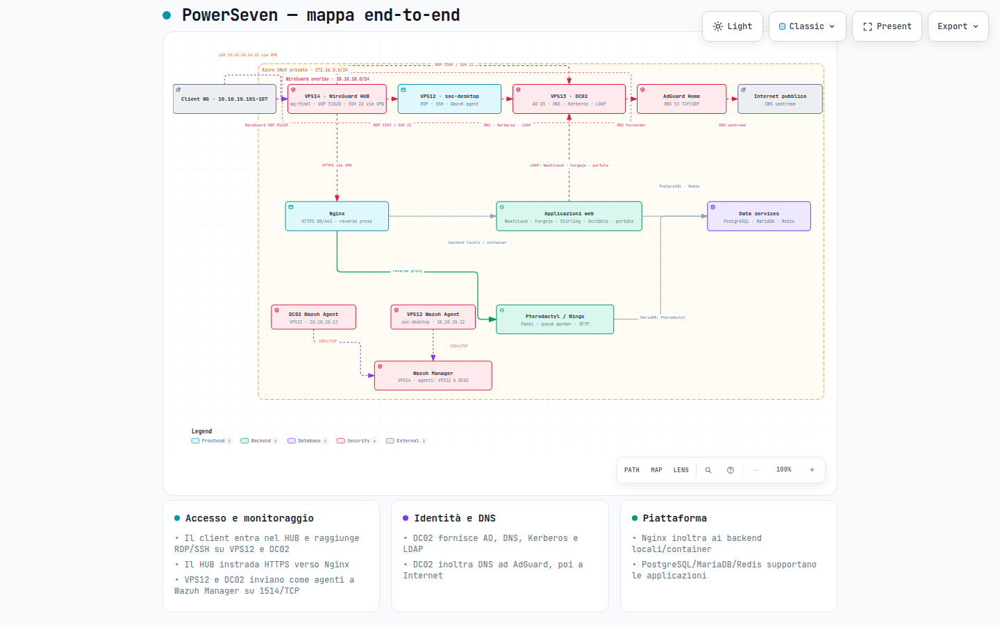
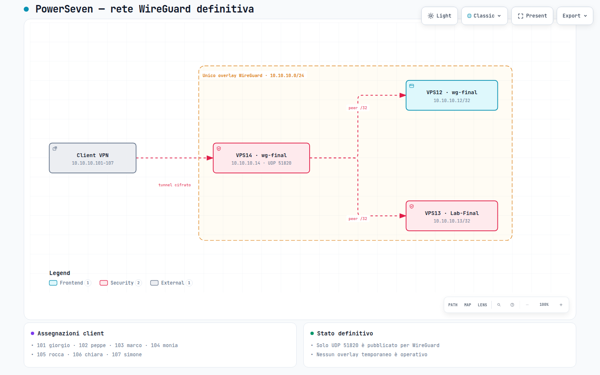
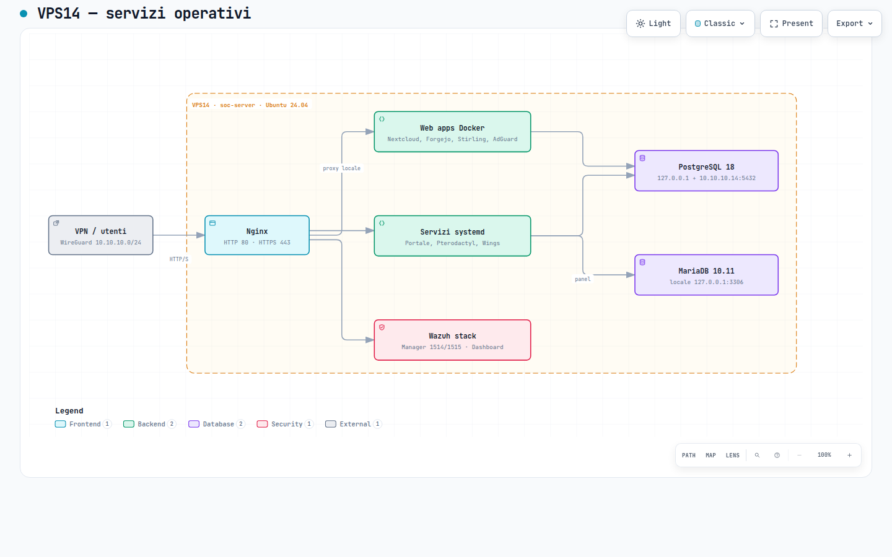

# PowerSeven

## Partecipanti

| Nome e cognome | Ruolo |
|---|---|
| Rocca Romaniello | Sistemista / Programmatore |
| Monia Montagna | Sistemista / Programmatore |
| Chiara Scaccia | Sistemista / Programmatore |
| Giuseppe Lucio Luca | Sistemista / Programmatore |
| Gianmarco Marseglia | Sistemista / Programmatore |
| Giorgio Gambelli | Sistemista / Programmatore |
| Anna Gloria Buchynska | Sistemista / Programmatore |
| **Simone Iengo** | **Tutor di progetto** |

PowerSeven è un laboratorio SOC distribuito su tre VM Azure collegate tramite una rete privata WireGuard. L'ambiente integra accesso remoto centralizzato, Active Directory, DNS, monitoraggio Wazuh, reverse proxy, servizi web, database e una piattaforma Pterodactyl.

L'obiettivo del progetto è fornire un'infrastruttura compatta ma completa per amministrazione di sistemi, networking, identity management, monitoraggio e gestione di servizi Linux/Windows in un unico ambiente.

## Architettura

La rete operativa WireGuard usa il segmento `10.10.10.0/24` con `soc-server` come hub centrale. I client autorizzati entrano nella VPN tramite UDP `51820` e da lì raggiungono le tre VM e i servizi interni.

| VM | IP VPN | Sistema | Ruolo principale |
|---|---:|---|---|
| `soc-desktop` | `10.10.10.12` | Ubuntu Desktop 24.04 | Desktop SOC condiviso, XRDP, SSSD/AD, Wazuh Agent |
| `DC02` | `10.10.10.13` | Windows Server 2022 | Domain Controller, DNS, Kerberos, LDAP, RDP, OpenSSH |
| `soc-server` | `10.10.10.14` | Ubuntu Server 24.04 | WireGuard Hub, Nginx, Wazuh, Docker, database e servizi applicativi |

### Mappa end-to-end

La vista principale mostra i percorsi di accesso, identità, DNS, applicazioni, database e monitoraggio.

[](diagrams/powerseven-end-to-end.html)

> Clicca sull'immagine per aprire il diagramma interattivo completo.

## Rete e accesso

L'accesso amministrativo avviene attraverso WireGuard. La porta pubblica dedicata alla VPN è UDP `51820` su VPS14; SSH e RDP vengono utilizzati sugli indirizzi `10.10.10.x` dopo l'ingresso nel tunnel.

| Funzione | Percorso |
|---|---|
| VPN | Client → `soc-server:51820/UDP` |
| SSH VPS14 | Client VPN → `10.10.10.14:22` |
| SSH VPS12 | Client VPN → `10.10.10.12:22` |
| SSH DC02 | Client VPN → `10.10.10.13:22` |
| RDP desktop SOC | Client VPN → `10.10.10.12:3389` |
| RDP Domain Controller | Client VPN → `10.10.10.13:3389` |
| DNS interno | Client/VM → DC02 `10.10.10.13` |
| DNS upstream | DC02 → AdGuard `10.10.10.14` → Internet |

### Topologia WireGuard

I sette client del laboratorio occupano gli indirizzi `10.10.10.101-107`; VPS14 instrada il traffico tra i peer e le VM interne.

[](diagrams/wireguard-network.html)

## Identità e DNS

`DC02` gestisce il dominio `lab.test` e concentra Active Directory Domain Services, DNS, Kerberos e LDAP. `soc-desktop` è integrato nel dominio tramite SSSD/Kerberos, mentre i servizi applicativi possono utilizzare LDAP per l'autenticazione centralizzata.

La zona DNS interna `lab.test` risolve i servizi applicativi verso `10.10.10.14`. Le richieste esterne vengono inoltrate da DC02 ad AdGuard Home, che svolge il ruolo di resolver/filter DNS verso Internet.

## Piattaforma applicativa

VPS14 concentra il livello applicativo del laboratorio. Nginx espone i servizi `*.lab.test` e inoltra le richieste ai backend locali o ai container Docker.

| Servizio | Endpoint interno | Ruolo |
|---|---|---|
| Nextcloud | `cloud.lab.test` | Cloud e collaborazione |
| Forgejo | `git.lab.test` | Git hosting |
| Stirling PDF | `pdf.lab.test` | Strumenti PDF |
| AdGuard Home | `adguard.lab.test` | DNS filtering e forwarding |
| Pterodactyl | `panel.lab.test` | Gestione game server |
| Wings | `wings.lab.test` | Daemon Pterodactyl |
| Wazuh | `wazuh.lab.test` | SIEM / monitoring |
| Portale | `login.lab.test` | Portale applicativo |
| Scribble | `scribble*.lab.test` | Servizi containerizzati |

### Servizi su VPS14

[](diagrams/vps14-services.html)

## Dati e monitoraggio

PostgreSQL 18 ospita i database principali di Nextcloud, Forgejo e del portale; MariaDB supporta Pterodactyl e Redis viene utilizzato come servizio di cache/queue dove previsto.

Wazuh è centralizzato su VPS14 con Manager, Indexer e Dashboard. VPS12 e DC02 inviano la telemetria al Manager tramite la rete WireGuard.

## Stack

| Area | Tecnologie |
|---|---|
| Cloud | Microsoft Azure |
| VPN | WireGuard |
| Linux | Ubuntu Server / Ubuntu Desktop |
| Windows | Windows Server 2022 |
| Identity | Active Directory, Kerberos, LDAP, SSSD |
| DNS | Windows DNS, AdGuard Home |
| Remote access | OpenSSH, XRDP, RDP |
| Reverse proxy / TLS | Nginx, CA interna |
| Containers | Docker |
| Database | PostgreSQL, MariaDB, Redis |
| Monitoring / SIEM | Wazuh |
| Dev / collaboration | Forgejo, Nextcloud |
| Game infrastructure | Pterodactyl, Wings |

## Diagrammi

| Diagramma | Vista interattiva | Descrizione |
|---|---|---|
| End-to-end | [Apri](diagrams/powerseven-end-to-end.html) | Intera infrastruttura e flussi principali |
| Architettura | [Apri](diagrams/architecture-overview.html) | Panoramica dei componenti |
| WireGuard | [Apri](diagrams/wireguard-network.html) | Hub, VM e client VPN |
| VPS14 | [Apri](diagrams/vps14-services.html) | Servizi e database del server centrale |
| Accesso remoto | [Apri](diagrams/remote-access-sequence.html) | Sequenza VPN → RDP → AD |
| DNS / Active Directory | [Apri](diagrams/dns-active-directory.html) | Risoluzione interna e servizi di dominio |
| Flusso web | [Apri](diagrams/application-flows.html) | HTTPS → Nginx → applicazioni → dati |

## Documentazione

| Area | Documento |
|---|---|
| Architettura | [docs/architecture.md](docs/architecture.md) |
| Inventario | [docs/inventory.md](docs/inventory.md) |
| Rete | [docs/network.md](docs/network.md) |
| WireGuard | [docs/wireguard.md](docs/wireguard.md) |
| Active Directory | [docs/active-directory.md](docs/active-directory.md) |
| DNS | [docs/dns.md](docs/dns.md) |
| Accesso remoto | [docs/remote-access.md](docs/remote-access.md) |
| Servizi | [docs/services.md](docs/services.md) |
| Docker | [docs/docker.md](docs/docker.md) |
| Database | [docs/databases.md](docs/databases.md) |
| Wazuh | [docs/monitoring-wazuh.md](docs/monitoring-wazuh.md) |
| Operazioni | [docs/operations.md](docs/operations.md) |
| Sicurezza | [docs/security.md](docs/security.md) |
| Troubleshooting | [docs/troubleshooting.md](docs/troubleshooting.md) |
| Disaster recovery | [docs/disaster-recovery.md](docs/disaster-recovery.md) |
| Knowledge graph | [graph/README.md](graph/README.md) |
| Modello IaC locale | [iac/README.md](iac/README.md) |
| Azure exit plan | [docs/azure-exit-plan.md](docs/azure-exit-plan.md) |

## Struttura repository

```text
PowerSeven/
├── README.md
├── docs/
│   ├── architecture.md
│   ├── network.md
│   ├── wireguard.md
│   ├── active-directory.md
│   ├── dns.md
│   ├── remote-access.md
│   ├── services.md
│   ├── docker.md
│   ├── databases.md
│   ├── monitoring-wazuh.md
│   ├── operations.md
│   ├── security.md
│   ├── troubleshooting.md
│   ├── disaster-recovery.md
│   └── azure-exit-plan.md
├── graph/
│   ├── README.md
│   └── powerseven.graph.json
├── iac/
│   ├── README.md
│   └── inventory/
└── diagrams/
    ├── powerseven-end-to-end.*
    ├── architecture-overview.*
    ├── wireguard-network.*
    ├── vps14-services.*
    ├── remote-access-sequence.*
    ├── dns-active-directory.*
    └── application-flows.* 
```

## Sicurezza

La repository contiene esclusivamente documentazione e rappresentazioni dell'architettura. Password, token, chiavi private, file `.env` e altri segreti non devono essere versionati.
